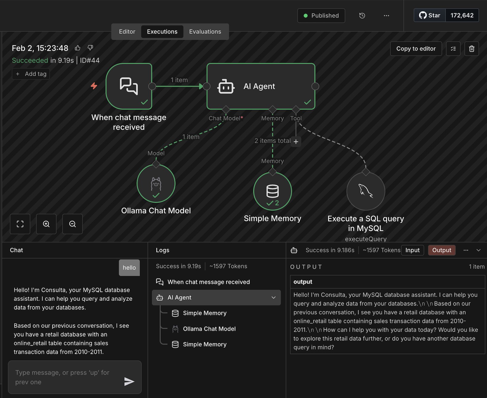

# 🧠 Agentic AI Workflow: MySQL Query Agent (Online Retail)

This project implements an **Agentic AI workflow** in **n8n** (or an ADK-based agent if specified by the course) that enables users to **query a MySQL database using plain English**.

It is adapted from the **pre-built agent shared in the course syllabus** and reconfigured to work with the **UCI Online Retail dataset** (course-provided link).

---

## What is n8n?

**n8n** (pronounced *n-eight-n*) is a powerful, source-available workflow automation platform. It allows users to connect applications, databases, and AI services using a **visual, node-based interface**.

It supports:
- No-code / low-code workflow creation
- Database integrations (MySQL, Postgres, etc.)
- AI-powered agents and tools
- Webhooks and API orchestration

In this project, n8n is used as the **agent runtime** that:
- Receives natural language questions
- Lets an LLM reason about the request
- Safely queries MySQL when needed
- Returns human-readable answers

---

## High-Level Architecture

- **MySQL** runs locally on the host machine (macOS)
- **n8n** runs inside a Docker container
- n8n connects to MySQL using `host.docker.internal`
- A dedicated MySQL user is created for n8n
- The agent enforces **read-only database access**

---

## Prerequisites

- Docker Desktop
- MySQL Community Server
- DBeaver (or another SQL client)
- Python 3 (optional, for CSV utilities)

---

## Step-by-Step Setup

---

## 1️⃣ Install and Start n8n (Docker)

### Download Docker Desktop
Install Docker Desktop from the official website.

### Follow official n8n Docker docs
https://docs.n8n.io/hosting/installation/docker/#using-with-postgresql

### Create Docker volume
```bash
docker volume create n8n_data
```

### Start n8n container
```bash
docker run -it --rm   --name n8n   -p 5678:5678   -e GENERIC_TIMEZONE="America/New_York"   -e TZ="America/New_York"   -e N8N_ENFORCE_SETTINGS_FILE_PERMISSIONS=true   -e N8N_RUNNERS_ENABLED=true   -v n8n_data:/home/node/.n8n   docker.n8n.io/n8nio/n8n
```

Verify container:
```bash
docker ps
```

Open n8n UI:
```
http://localhost:5678
```

---

## 2️⃣ Install MySQL & Verify Installation

Install **MySQL Community Server**.

Verify:
```bash
/usr/local/mysql/bin/mysql -u root -p
```

---

## 3️⃣ Add MySQL to PATH (macOS)

```bash
vim ~/.zshrc
export PATH="/usr/local/mysql/bin:$PATH"
```

Save and reload:
```bash
source ~/.zshrc
```

Verify:
```bash
which mysql
# /usr/local/mysql/bin/mysql
```

---

## 4️⃣ Dataset Preparation (Online Retail)

The Excel workbook contains **two sheets**:
- 2009–2010
- 2010–2011

Excel cannot export multiple sheets to a single CSV.

### Correct (Excel-only) Method

1. Open the Excel file
2. Select sheet **2009–2010**
3. File → Save As → CSV UTF-8
4. Name:
   - `online_retail_2009-2010.csv`
   - `online_retail_2010-2011.csv`

Merge files:
```bash
(head -n 1 online_retail_2009-2010.csv &&  tail -n +2 online_retail_2009-2010.csv &&  tail -n +2 online_retail_2010-2011.csv) > online_retail_all.csv
```

---

### Alternative (CLI)

```bash
pip3 install xlsx2csv
xlsx2csv online_retail.xlsx -s 1 online_retail_2009-2010.csv
xlsx2csv online_retail.xlsx -s 2 online_retail_2010-2011.csv
```

Sanity check:
```bash
wc -l online_retail_2009-2010.csv online_retail_2010-2011.csv online_retail_all.csv
```

Expected:
```
lines(file1) + lines(file2) - 1 = total lines
```

---

## 5️⃣ Create Database and Table (DBeaver)

### Connect to MySQL
- Host: `localhost`
- Port: `3306`
- Username: `root`
- Password: your MySQL password

⚠️ Do **not** select a database yet.

---

### Create Database
```sql
CREATE DATABASE retail_db
CHARACTER SET utf8mb4
COLLATE utf8mb4_unicode_ci;
```

Verify:
```sql
USE retail_db;
SHOW DATABASES;
```

---

### Create Table
```sql
CREATE TABLE online_retail (
  id BIGINT UNSIGNED NOT NULL AUTO_INCREMENT,
  invoice_no VARCHAR(20) NOT NULL,
  stock_code VARCHAR(20) NOT NULL,
  description VARCHAR(255),
  quantity INT NOT NULL,
  invoice_ts VARCHAR(20) NOT NULL,
  unit_price DECIMAL(10,2) NOT NULL,
  customer_id INT NULL,
  country VARCHAR(100) NOT NULL,
  PRIMARY KEY (id)
);
```

> `invoice_ts` is intentionally stored as VARCHAR to avoid losing ~300k rows during CSV import.

---

## 6️⃣ Import CSV into MySQL

- Right-click `online_retail` table → Import Data
- Choose CSV
- Select `online_retail_all.csv`
- Map columns carefully
- Use UTF-8 encoding
- Disable strict datetime parsing

Verify:
```sql
SELECT COUNT(*) FROM online_retail;
```

---

## 7️⃣ MySQL Users & Docker Networking (Important)

### Understand the Setup

- MySQL runs on your **Mac**
- n8n runs inside **Docker**
- From Docker, `localhost` ≠ your Mac
- Docker must use: `host.docker.internal`

---

### Create Localhost User (Testing Only)

```sql
CREATE USER 'n8n_user'@'localhost' IDENTIFIED BY 'your_password_here';
GRANT ALL PRIVILEGES ON retail_db.* TO 'n8n_user'@'localhost';
FLUSH PRIVILEGES;
```

Test:
```bash
mysql -u n8n_user -p -h 127.0.0.1
```

Reference:
https://stackoverflow.com/questions/50409788/mysql-8-create-new-user-with-password-not-working

---

### Create Docker-Accessible User (Required)

```sql
CREATE USER 'n8n_user'@'%' IDENTIFIED BY 'StrongPassword123!';
GRANT ALL PRIVILEGES ON retail_db.* TO 'n8n_user'@'%';
FLUSH PRIVILEGES;
```

Verify:
```sql
SELECT User, Host FROM mysql.user WHERE User='n8n_user';
```

Check MySQL bind address:
```bash
mysql -u root -p -e "SHOW VARIABLES LIKE 'bind_address';"
```

---

## 8️⃣ Configure MySQL Credentials in n8n

n8n UI → Credentials → Add Credential → MySQL

| Field | Value |
|-----|-----|
| Host | host.docker.internal |
| Port | 3306 |
| Database | retail_db |
| User | n8n_user |
| Password | StrongPassword123! |
| SSL | Off |

Test query:
```sql
SELECT NOW();
```

If it returns a timestamp → ✅ connected.

---

## 9️⃣ Agent System Prompt

The agent follows these rules:

- Use MySQL only when data is required
- Never modify the database
- Only query existing tables and columns
- Limit result size
- Ask clarifying questions if ambiguous
- Never expose raw SQL errors

---


## 🔗 AI Provider Configuration

- Ollama: https://ollama.com/api
- OpenAI: https://platform.openai.com/api-keys
- Gemini: https://ai.google.dev/gemini-api/docs/api-key

---

## 🌐 Webhook Endpoint

Example:
```
http://localhost:5678/webhook/<your-webhook-id>/chat
```

---

## 🔁 Restarting the System Later

### Start MySQL
```bash
mysql.server start
```

### Restart n8n
```bash
docker run -it --rm   --name n8n   -p 5678:5678   -e GENERIC_TIMEZONE="America/New_York"   -e TZ="America/New_York"   -e N8N_ENFORCE_SETTINGS_FILE_PERMISSIONS=true   -e N8N_RUNNERS_ENABLED=true   -v n8n_data:/home/node/.n8n   docker.n8n.io/n8nio/n8n
```

All workflows, credentials, and agent configuration persist via the Docker volume.

---

## ✅ Final Outcome



You now have a fully functional **Agentic AI MySQL Query Assistant** that:
- Converts natural language to SQL
- Enforces read-only safety
- Uses Docker correctly
- Matches the course Agentic AI requirements


