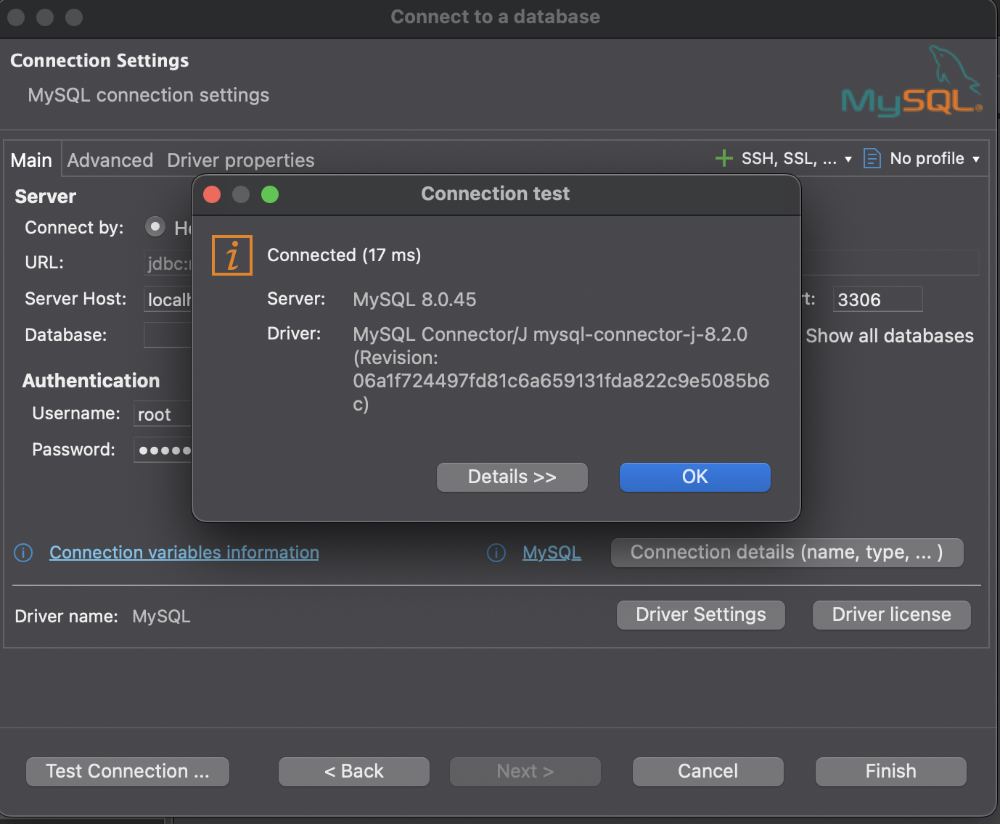
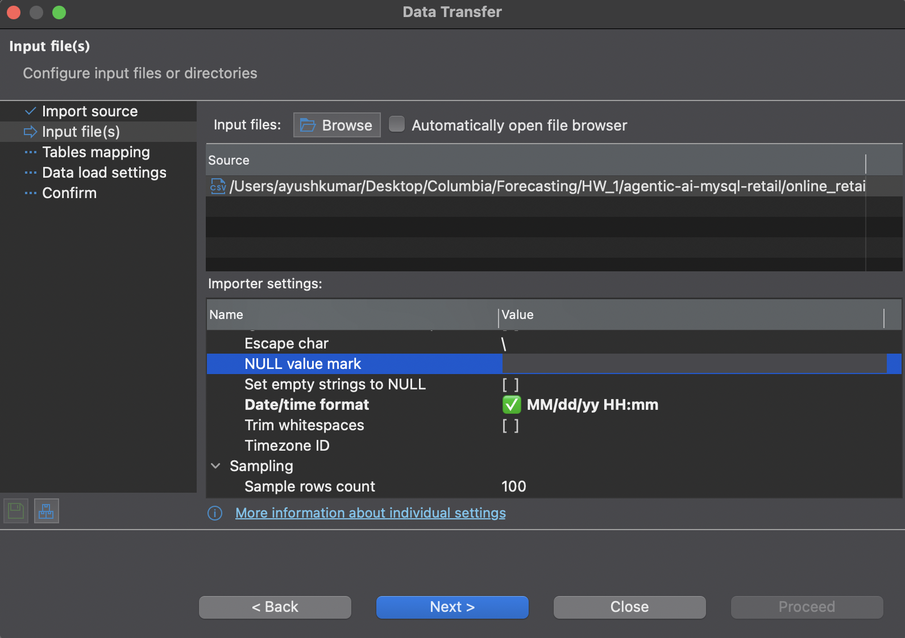
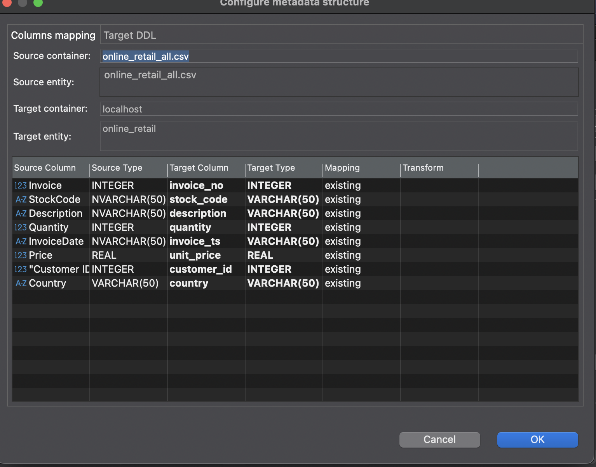
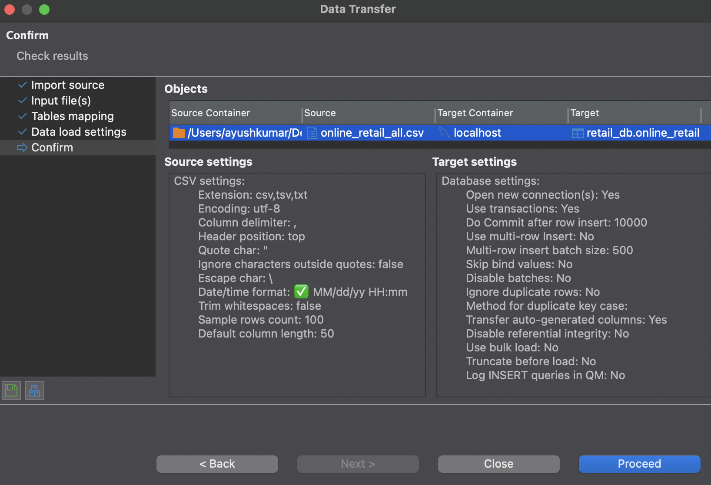

# Agentic AI Workflow: MySQL Query Agent (Online Retail)

This project implements an **Agentic AI workflow** in **n8n** (or ADK-based agent if specified by the course) that lets a user **query a MySQL database using plain English**.  
It is adapted from the pre-built agent shared in the syllabus and re-assigned to the **Online Retail dataset** (UCI Online Retail / course-provided link).

-- n8n (pronounced n-eight-n) is a powerful, source-available workflow automation tool that allows users to connect applications, databases, and AI services to automate tasks using a visual, node-based interface. It acts as a "no-code" or "low-code" platform where users can create custom automation, such as syncing data between apps like Slack, Jira, and Google Sheets, or building complex AI-powered workflows. 

## steps to setup

- Download docker Desktop
- Follow guidelines here - https://docs.n8n.io/hosting/installation/docker/#using-with-postgresql
- Starting n8n

## run in terminal
- docker volume create n8n_data

docker run -it --rm \
  --name n8n \
  -p 5678:5678 \
  -e GENERIC_TIMEZONE="America/New_York" \
  -e TZ="America/New_York" \
  -e N8N_ENFORCE_SETTINGS_FILE_PERMISSIONS=true \
  -e N8N_RUNNERS_ENABLED=true \
  -v n8n_data:/home/node/.n8n \
  docker.n8n.io/n8nio/n8n

- docker ps ( to check container)

- Download MySQL Community Server
- /usr/local/mysql/bin/mysql -u root -p (run in terminal to check if downloaded)
- Download Dbeaver
- Your workbook has two sheets (2009–2010, 2010–2011), so Excel refuses to save the entire workbook as a single CSV.

✅ Correct way to handle this (Excel-only, fastest)

You must save each sheet separately.

Step-by-step (do exactly this)

1️⃣ Open the Excel file
2️⃣ Click the first sheet (e.g. 2009–2010)
3️⃣ Go to:

File → Save As → CSV UTF-8 (.csv)

4️⃣ Name it:

online_retail_2009-2010.csv
online_retail_2010-2011.csv

- On termonal run below

- (head -n 1 online_retail_2009-2010.csv && tail -n +2 online_retail_2009-2010.csv && tail -n +2 online_retail_2010-2011.csv) > online_retail_all.csv

## Alternatively

pip3 install xlsx2csv
xlsx2csv online_retail.xlsx -s 1 retail_2009-2010.csv
xlsx2csv online_retail.xlsx -s 2 retail_2010-2011.csv

- sanity check

wc -l online_retail_2009-2010.csv online_retail_2010-2011.csv online_retail_all.csv
-- lines(file1) + lines(file2) - 1 (should be the result)

- Create the table in DBeaver

Open DBeaver

STEP 0️⃣ Open DBeaver & connect to MySQL server

Open DBeaver

Click New Database Connection

Choose MySQL

Enter:

Host: localhost

Port: 3306

Username: (e.g. root)

Password: your MySQL password

Click Test Connection

Click Finish

⚠️ Do not enter a database name yet.

STEP 1️⃣ Create the database

In Database Navigator, click your MySQL connection

Right-click → SQL Editor → New SQL Script

Run:

CREATE DATABASE retail_db
CHARACTER SET utf8mb4
COLLATE utf8mb4_unicode_ci;

-- verify
USE retail_db;
SHOW DATABASES;

STEP 3️⃣ Create the table

### id as a surrogate primary key

## see the csv and then map the schema

CREATE TABLE online_retail (
  id BIGINT UNSIGNED NOT NULL AUTO_INCREMENT,
  invoice_no VARCHAR(20) NOT NULL,
  stock_code VARCHAR(20) NOT NULL,
  description VARCHAR(255),
  quantity INT NOT NULL,
  invoice_ts VARCHAR(20) NOT NULL,
  unit_price DECIMAL(10,2) NOT NULL,
  customer_id INT NULL,
  country VARCHAR(100) NOT NULL,
  PRIMARY KEY (id)
);

STEP 4️⃣ Refresh DBeaver view

Right-click online_retail database → Refresh

Expand:

online_retail
 └── Tables
      └── online_retail

STEP 5️⃣ Import CSV into the table

Right-click table online_retail

Select Import Data

Choose CSV

Select file: online_retail_all.csv

make changes 

Click Next

double click online_retail_csv_all

and map all the columns from csv to the one's created via table

change invoice date to  varchar (else almost 300k rows lost due to datetime conversion error)

Check 6️⃣ CSV settings (VERY IMPORTANT)

select count(*) from online_retail   -- 702890 decreased from (1067370) // previously

select count(*) from online_retail  - 1067370 (no loss in data)

## recommended (not done yet)
ALTER TABLE online_retail DROP COLUMN invoice_ts;
ALTER TABLE online_retail CHANGE invoice_ts_dt invoice_ts DATETIME NOT NULL;